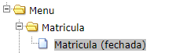
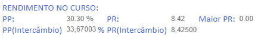
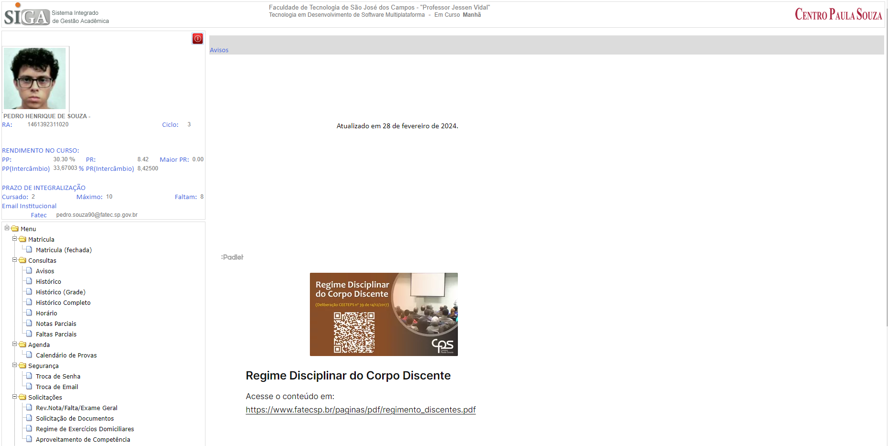
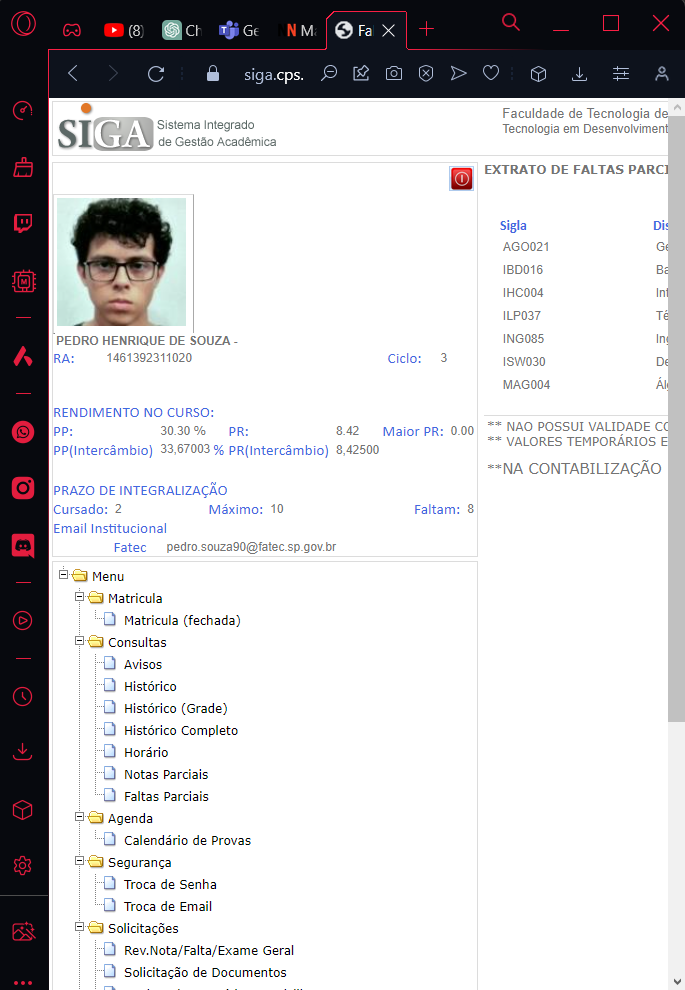

# BERTOTI

HEURISTICAS

<ul>
    <li>Heuristica 1 - quando clica em "Matricula (fechada)", não acontece absolutamente nada</li>
</ul>
 

<ul>
   <li>Heurística 2 - usa jargões internos, não sei o que é PP e PR</li>
</ul>
 

<ul>
    <li>Heuristica 4 - muita informação de um lado só</li>
</ul>

 

<ul>
    <li>Heuristica 7 - não é responsivo</li>
</ul>
