# BERTOTI

HEURISTICAS

<ul>
    <li>Heuristica 1 - quando clica em "Matricula (fechada)", não acontece absolutamente nada</li>
</ul>

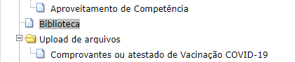
<ul>
    <li>Heuristica 1 - eu clico em biblioteca e nada acontece</li>
</ul>

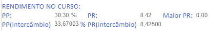
<ul>
   <li>Heurística 2 - usa jargões internos, não sei o que é PP e PR</li>
</ul>

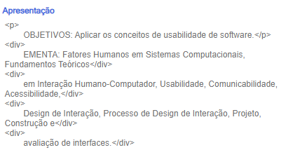
<ul>
    <li>Heuristica 2 - esta utilizando comandos de HTML printando na tela como se fosse de fato parte do texto enquanto não é</li>
</ul>

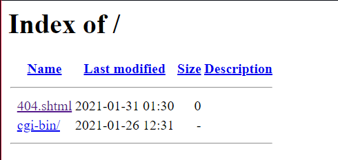
<ul>
    <li>Heuristica 2 - totalmente desconexo com a realidade, mostra o nome de arquivos</li>
</ul>

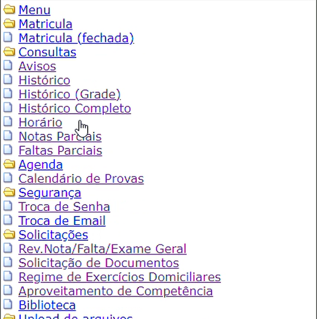
<ul>
    <li>Heuristica 4 - a pagina não era assim no canto, mas quando eu cliquei em histórico isso aconteceu, perdeu seu estilo padrão nessa parte</li>
</ul>

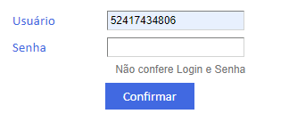
<ul>
    <li>Heuristica 4 - com apenas o usuario e escrito corretamente ele não diz qual erro que é</li>
</ul>

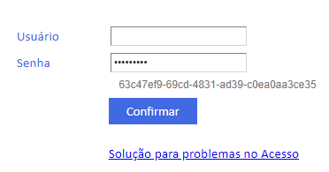
<ul>
    <li>Heuristica 4 - não diz que erro deu quando eu coloquei apenas a senha</li>
</ul>

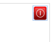
<ul>
    <li>Heuristica 5 - quando eu clico para sair, eu saio direto, não pergunta se eu tenho certeza, posso apertar o botão sem querer e serei deslogado</li>
</ul>

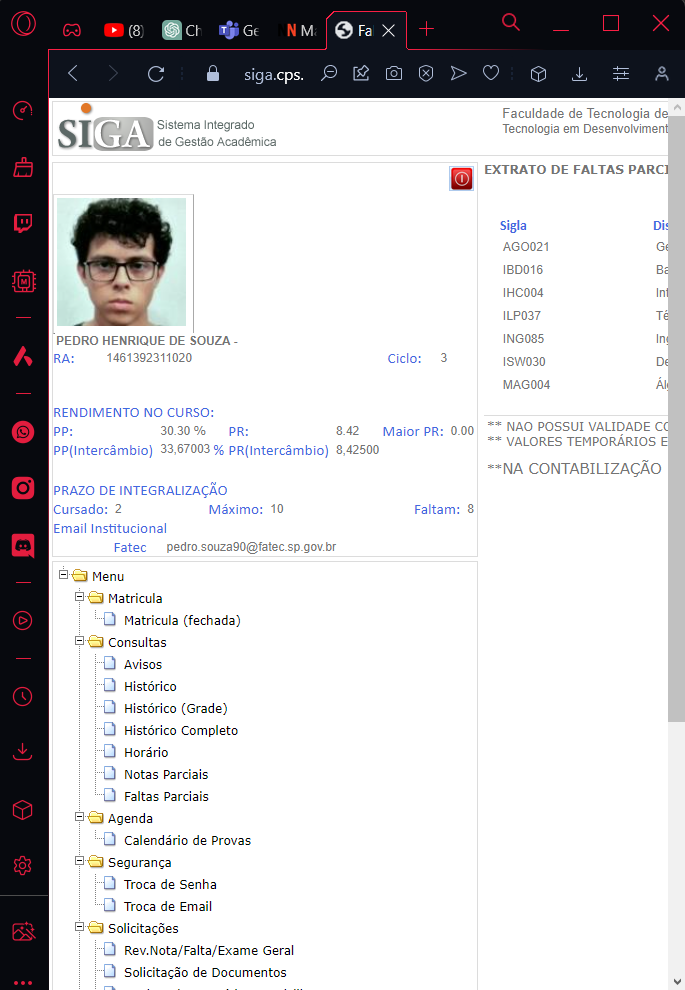
<ul>
    <li>Heuristica 7 - não é responsivo</li>
</ul>

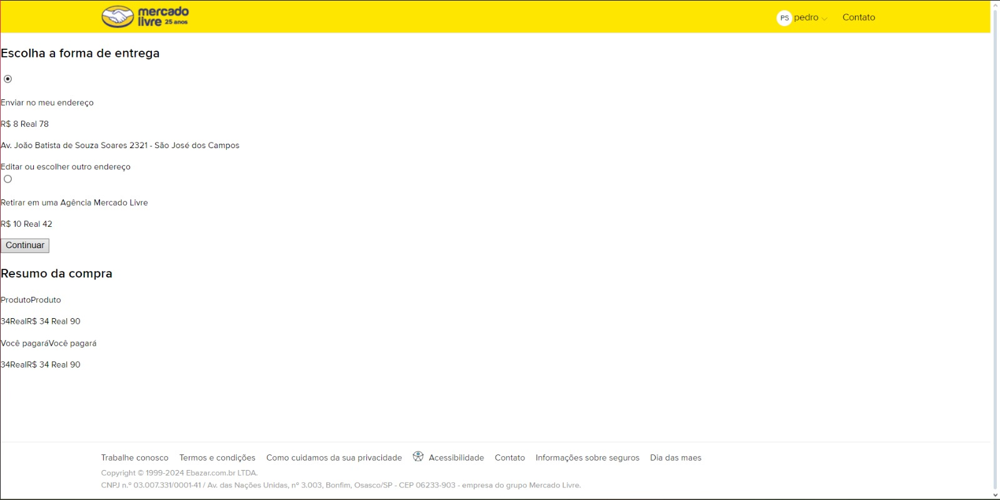
<ul>
    <li>Heuristica 8 - Sem design agradavel</li>
</ul>

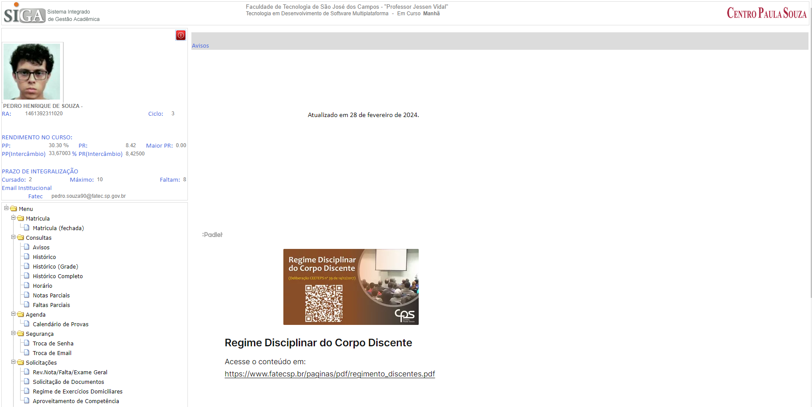
<ul>
    <li>Heuristica 8 - muita informação de um lado só</li>
</ul>

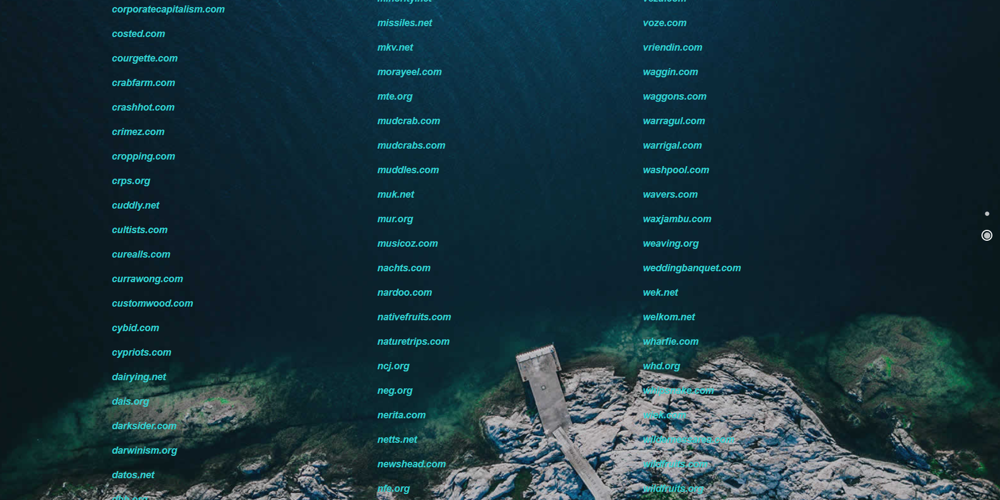
<ul>
    <li>Heuristica 8 - contraste do site com as letras brancas não é bom, ele fica legal quando está em cima do mar, mas quando está em cima das pedras é quase impossivel de visualizar o que está escrito nele</li>
</ul>